# Welcome to SMARS Community Edition

## Document Control

| Version | Author        | Date         |
|---------|---------------|--------------|
| 1.0     | Kevin McAleer | 12 June 2020 |

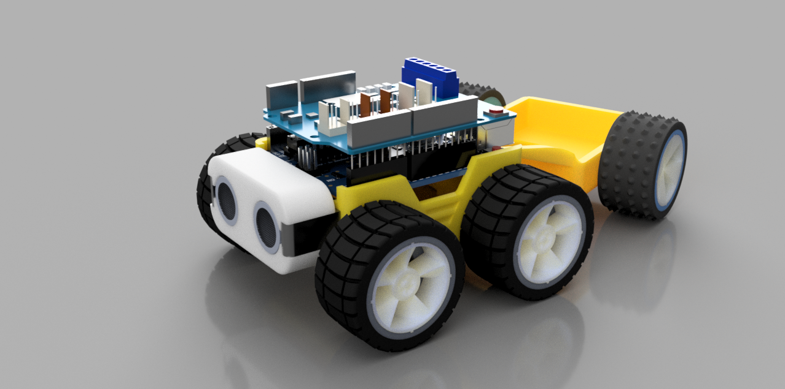

## Contents
This folder contains the following:

- Design PDFs: a collection of PDFs outlining key measurements of the original SMARS designs
- Pictures: some renders of the various components
- STLs: the 3d printable models

## Further Information

 For more information about the SMARS project, visit:
 <https://www.smarsfan.com>

## The STLs

The table below lists each of the STL files available for 3d printing, a short description and a rendered image of the part.
| Filename                                 | Description         | Image                                                             |
|------------------------------------------|---------------------|-------------------------------------------------------------------|
| [STLs/SMARS CE Chassis.stl]()            | The Base Chassis    | 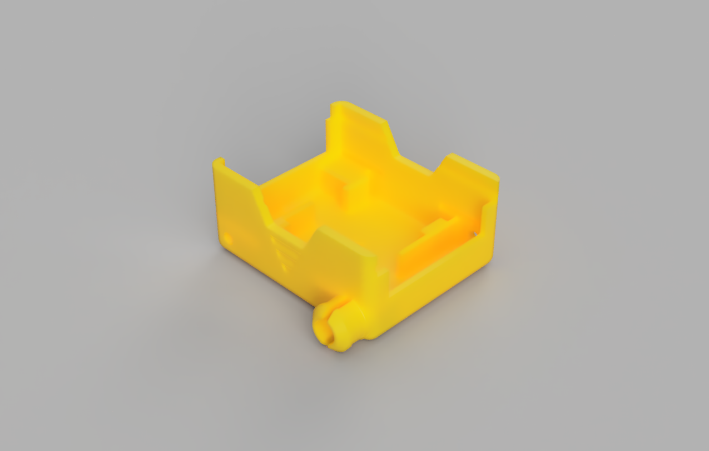                                  |
| [STLs/SMARS CE Master Wheel.stl]()       | Master Wheel        | 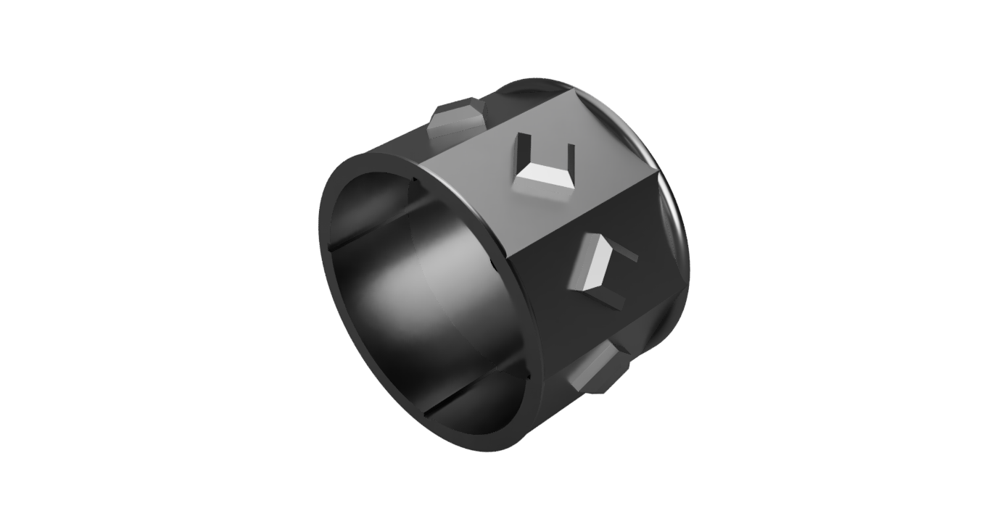               |
| [STLs/SMARS CE Slave Wheel.stl]()        | Slave wheel         | 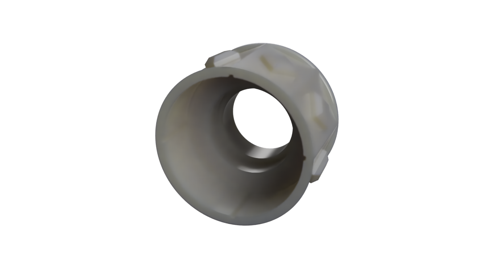                 |
| [STLs/SMARS CE Range Finder Holder]()    | Range Finder Holder | 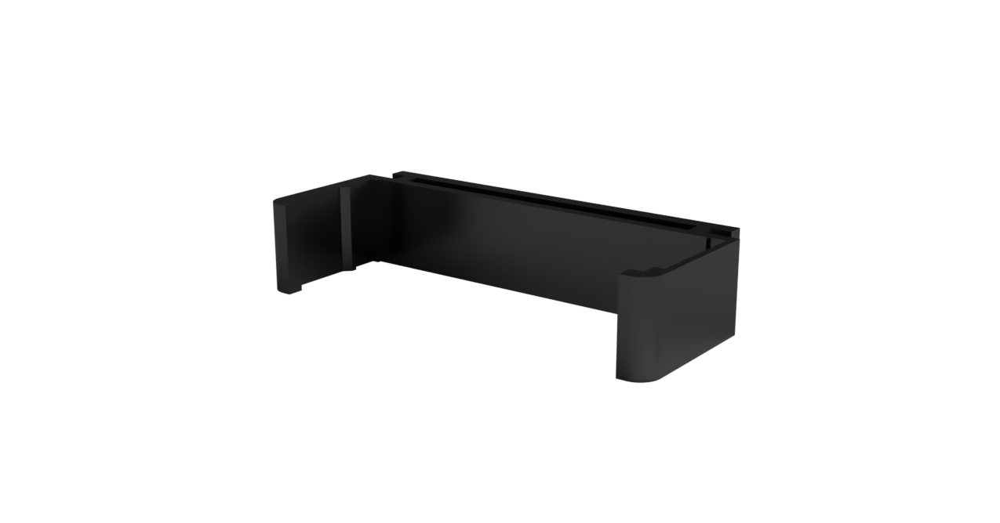 |
| [STLs/SMARS CE Range Finder Cover.stl]() | Range Finder Cover  | 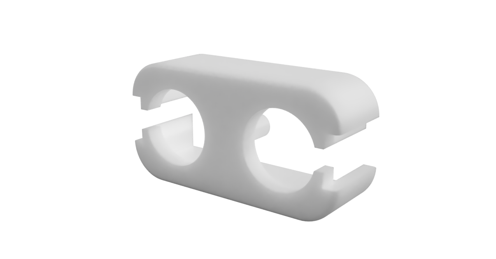   |
| [STLs/SMARS CE Bumpy Tyre.stl]()         | Bumpy Tyre          | 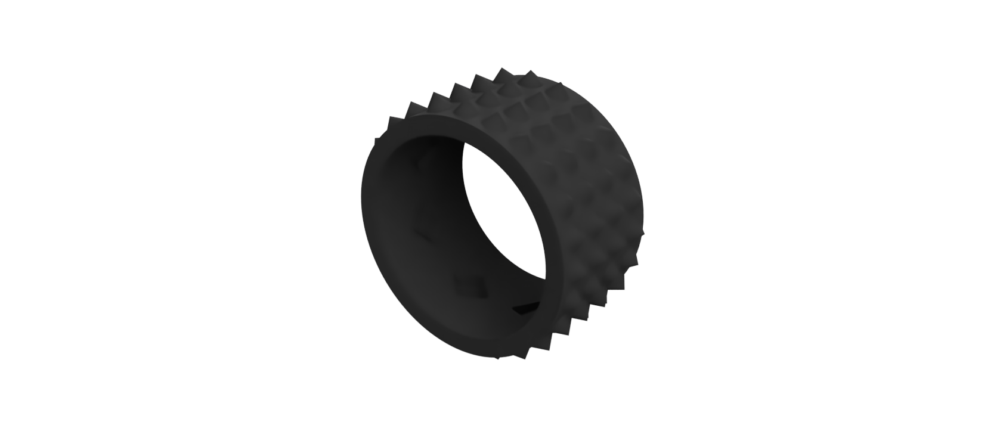                   |
| [STLs/SMARS CE Trailer.stl]()            | Trailer             | 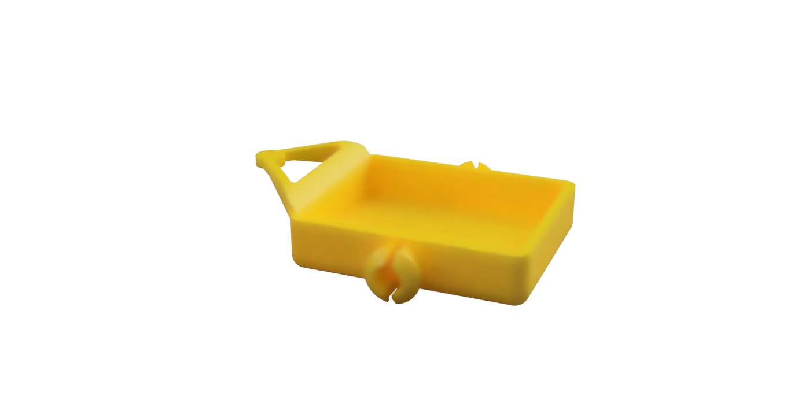                         |
| [STLs/SMARS CE Tyre.stl]()               | Tyre                | 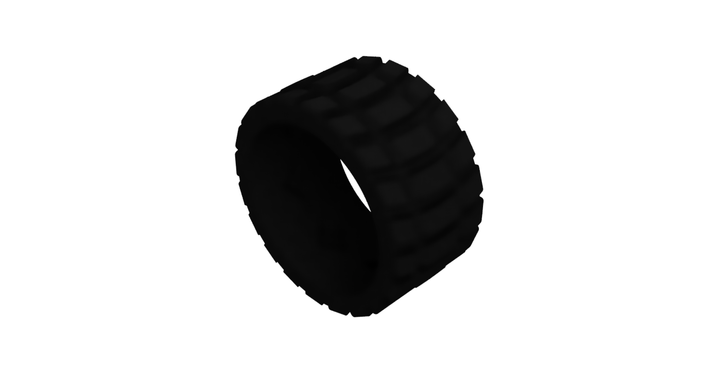                               |
| [STLs/SMARS CE Wheel 2 Spoke.stl]()      | Wheel 2 Spoke       |              |
| [STLs/SMARS CE Wheel 4 Spoke.stl]()      | Wheel 4 Spoke       | 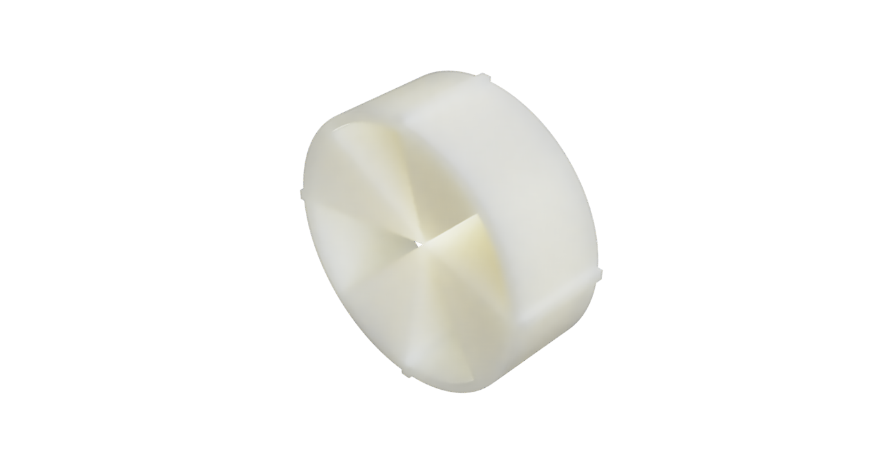             |
| [STLs/SMARS CE Wheel 5 Spoke.stl]()      | Wheel 5 Spoke       | 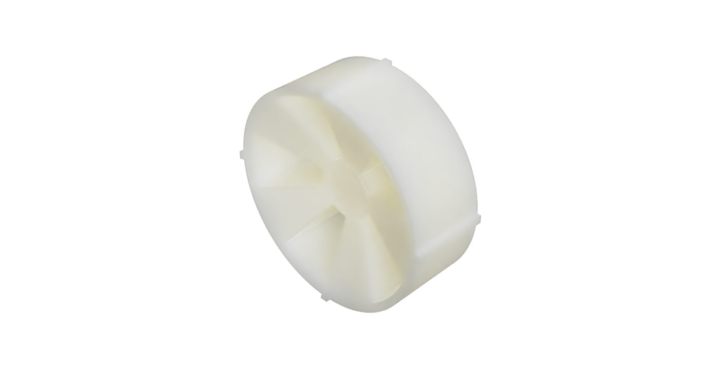             |
| [STLs/SMARS CE Wheel 6 Spoke.stl]()      | Wheel 6 Spoke       | 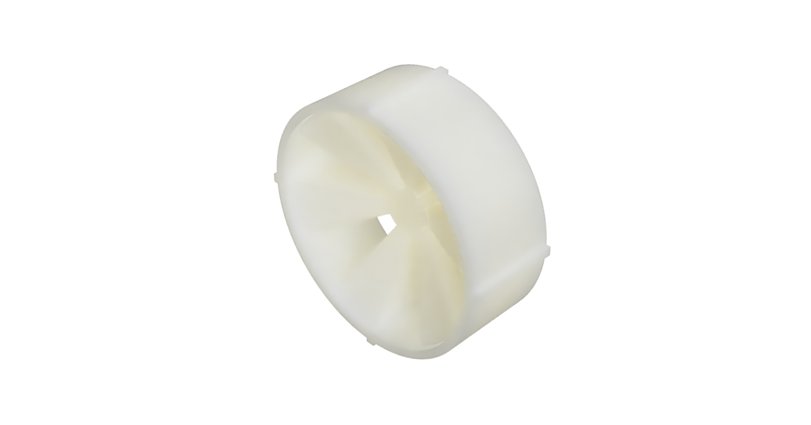             |
| [STLs/SMARS CE Wheel Curved.stl]()       | Wheel Curved        | 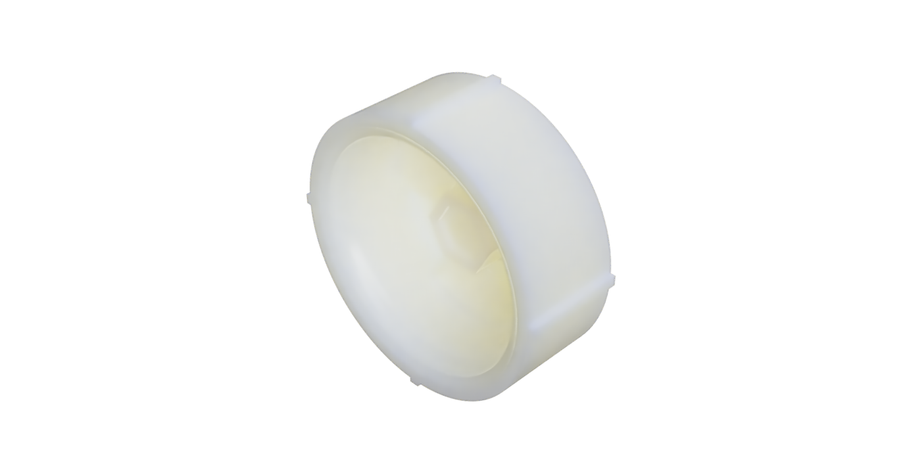               |

### TODO

- [ ] The Motor holder is currently missing
- [ ] The trailer connector is currently missing
