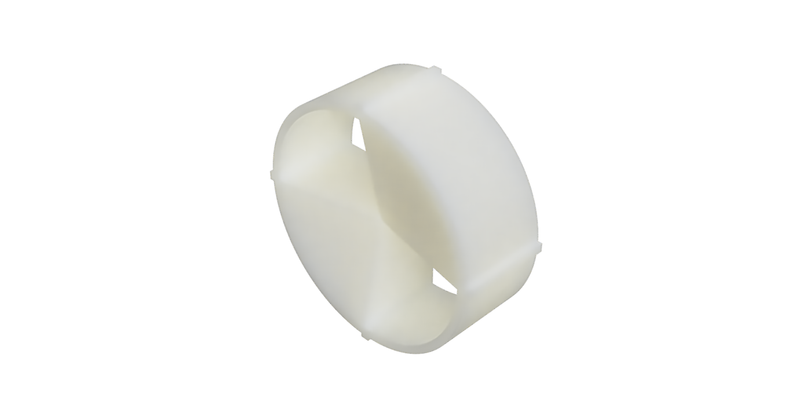

# Welcome to SMARS Community Edition

## Document Control

| Version | Author        | Date         |
|---------|---------------|--------------|
| 1.0     | Kevin McAleer | 12 June 2020 |

## Contents

This folder contains the following:

- Design PDFs: a collection of PDFs outlining key measurements of the original SMARS designs
- Pictures: some renders of the various components
- STLs: the 3d printable models

## Further Information

 For more information about the SMARS project, visit:
 <https://www.smarsfan.com>

## The Design PDFs

There are a couple of design documents that illustrate the key measurements and dimnesions for SMARS robots, these are:

- [SMARS_CE_Wheel_Hub.pdf](Design/SMARS_CE_Wheel_Hub.pdf)
- [SMARS_CE_Chassis.pdf](Design/SMARS_CE_Chassis.pdf)

## The STLs

The table below lists each of the STL files available for 3d printing, a short description and a rendered image of the part.
| Filename                                                                           | Description         | Image                                                             |
|------------------------------------------------------------------------------------|---------------------|-------------------------------------------------------------------|
| [STLs/SMARS_CE_Chassis.stl](STLs/SMARS_CE_Chassis.stl)                             | The Base Chassis    |                                   |
| [STLs/SMARS_CE_Master_Wheel.stl](STLs/SMARS_CE_Master_Wheel.stl)                   | Master Wheel        |                |
| [STLs/SMARS_CE_Slave_Wheel.stl](STLs/SMARS_CE_Slave_Wheel.stl)                    | Slave wheel         |                  |
| [STLs/SMARS_CE_Range_Finder_Holder.stl](STLs/SMARS_CE_Range_Finder_Holder.stl)             | Range Finder Holder |  |
| [STLs/SMARS_CE_Range_Finder_Cover.stl](STLs/SMARS_CE_Range_Finder_Cover.stl)       | Range Finder Cover  |    |
| [STLs/SMARS_CE_Bumpy_Tyre.stl](STLs/SMARS_CE_Bumpy_Tyre.stl)                       | Bumpy Tyre          |                    |
| [STLs/SMARS_CE_Trailer.stl](STLs/SMARS_CE_Trailer.stl)                             | Trailer             |                          |
| [STLs/SMARS_CE_Tyre.stl](STLs/SMARS_CE_Tyre.stl)                                   | Tyre                |                                |
| [STLs/SMARS_CE_Wheel_2_Spoke.stl](STLs/SMARS_CE_Wheel_2_Spoke.stl)                 | Wheel 2 Spoke       |              |
| [STLs/SMARS_CE_Wheel_4_Spoke.stl](STLs/SMARS_CE_Wheel_4_Spoke.stl)                 | Wheel 4 Spoke       |              |
| [STLs/SMARS_CE_Wheel_5_Spoke_Dynamic.stl](STLs/SMARS_CE_Wheel_5_Spoke_Dynamic.stl) | Wheel 5 Spoke       |              |
| [STLs/SMARS_CE_Wheel_6_Spoke.stl](STLs/SMARS_CE_Wheel_6_Spoke.stl)                 | Wheel 6 Spoke       |              |
| [STLs/SMARS_CE_Wheel_Curved.stl](STLs/SMARS_CE_Wheel_Curved.stl)                   | Wheel Curved        |                |

### TODO

- [ ] The Motor holder is currently missing
- [ ] The trailer connector is currently missing
